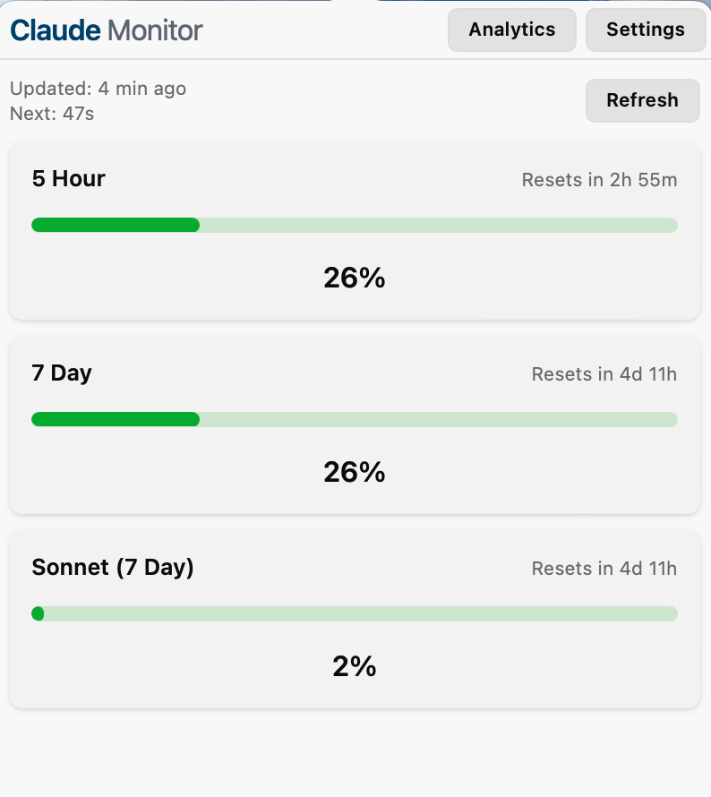
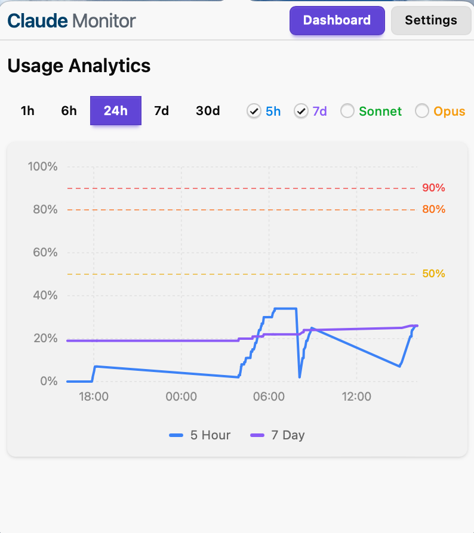
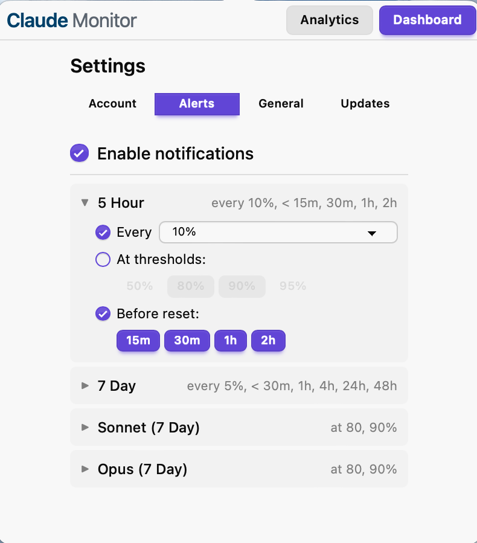
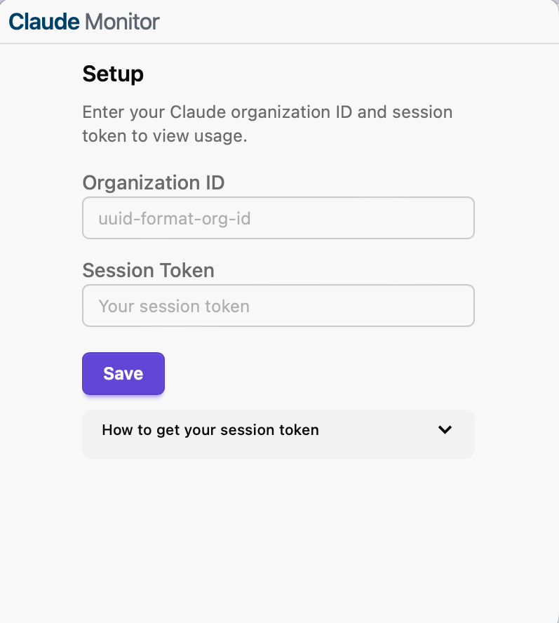

# Claude Monitor

A lightweight system tray application for monitoring your Claude API usage in real-time.

<p align="center">
  
</p>

## Features

- **Real-time Usage Tracking** — Monitor 5-hour, 7-day, Sonnet, and Opus usage limits
- **Usage Analytics** — Visualize usage trends over time (1h to 30d)
- **Smart Notifications** — Get alerts at custom thresholds or time intervals
- **Auto-refresh** — Configurable background updates (1-30 min)
- **System Tray** — Runs quietly in the background with usage in tooltip
- **Auto-update** — Automatic update checks with one-click install
- **Cross-platform** — macOS, Windows, and Linux

<p align="center">
  
  
</p>

## Installation

Download the latest release for your platform from [GitHub Releases](https://github.com/xikxp1/claude-monitor/releases):

| Platform | Download |
|----------|----------|
| macOS | `.dmg` (Universal) |
| Windows | `.msi` or `.exe` |
| Linux | `.AppImage` or `.deb` |

### Setup

1. Launch the app — it will appear in your system tray
2. Click the tray icon to open the setup window
3. Enter your Organization ID and Session Token

<p align="center">
  
</p>

**To get your session token:**
1. Go to [claude.ai](https://claude.ai) and log in
2. Open DevTools (F12) → Application → Cookies → claude.ai
3. Copy the `sessionKey` cookie value

## Contributing

### Prerequisites

- [Rust](https://rustup.rs/) (stable)
- [Bun](https://bun.sh/)
- Platform dependencies: [Tauri prerequisites](https://tauri.app/start/prerequisites/)

### Development

```bash
# Clone and install
git clone https://github.com/xikxp1/claude-monitor.git
cd claude-monitor
bun install

# Run in development
bun run tauri dev

# Run tests
bun run test                      # Frontend
cd src-tauri && cargo test        # Backend

# Build for production
bun run tauri build
```

### Project Structure

```
src/                  # Frontend (SvelteKit 5 + TypeScript)
src-tauri/            # Backend (Rust + Tauri 2)
.github/workflows/    # CI/CD (test, build, release)
```

## License

MIT
